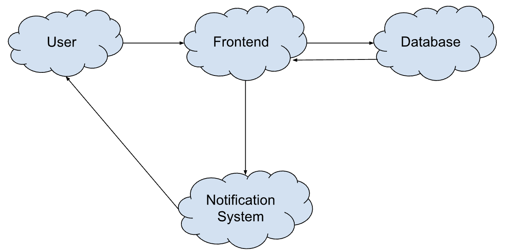

# BACtrack DESIGN

## System Architecture

Here is the system architecture diagram for the BACtrack application:

### Diagram Text Representation:
1. **User interacts with**:
   - **Frontend (Android App)**, which is the main interface for all features.

2. **Frontend (Android App) connects to**:
   - **Local Database (Firebase)** for storing user data like profile details, drink logs, and history.
   - **Notification System** for sending reminders or quick logging options.

3. **Local Database (Firebase)** sends and receives data to/from:
   - **Frontend (Android App)** to manage local storage.

4. **Notification System interacts with**:
   - **User** by providing alerts or logging options directly.

### Explanation

1. **Frontend**:
   - Built using Kotlin (Android Studio) with Jetpack Compose.
   - Features implemented include real-time BAC calculation, drink logging, and profile management.

2. **Local Database**:
   - Stores user data securely offline to ensure the app works with and without an internet connection.

3. **Notification System**:
   - Enables users to log drinks quickly or get reminders about their BAC.

---

## Team Decisions

| Date       | Meeting     | Summary                                                                                   |
|------------|-------------|-------------------------------------------------------------------------------------------|
| Oct 4      | Section 1   | Assigned roles and organized GitHub.                                                      |
| Oct 7      | Lecture 3   | Established norms, subject to change or development in future meetings.                   |
| Oct 9      | Lecture 4   | Wrote `scenario.md`, discussed HelloWorld questions, decided on app name, and planned extra meetings. |
| Oct 10     | Zoom Meeting| Discussed progress on HelloWorld assignment, resolved emulator problems, and reviewed app scenario. |
| Oct 11     | Section 2   | Discussed coding benefits/challenges with Android Studio, resolved GitHub organization issues. |
| Oct 14     | Lecture 5   | Chose Firebase for login and database, set up GitHub Projects for Kanban board.            |
| Oct 16     | Lecture 6   | Worked on Homework 2 to get familiar with Firebase and OAuth.                              |
| Oct 17     | Zoom Meeting| Sprint planning for Sprint 2.                                                              |
| Oct 18     | Section 3   | Completed first retrospective.                                                             |
| Oct 21     | Lecture 7   | Started Sprint 2.                                                                          |
| Oct 23     | Lecture 8   | Planned MVP deliverables, resolved GitHub issues, and created a Figma file for the UI.     |
| Oct 25     | Section 4   | Continued MVP planning and documentation.                                                  |
| Oct 28     | Lecture 9   | Continued working on MVP features.                                                         |
| Oct 30     | Lecture 10  | Added to MVP functionality.                                                                |
| Nov 1      | Section 5   | Focused on personal contributions to complete MVP.                                         |
| Nov 4      | Lecture 11  | Conducted app testing and discussed next steps.                                            |
| Nov 6      | Lecture 12  | Completed project check-ins and planned for final weeks.                                   |
| Nov 8      | Section 6   | Prepared for Retro 2.                                                                      |
| Nov 13     | Lecture 13  | Discussed project progress for HW04 and Sec07 deliverables.                                |
| Nov 15     | Section 7   | Worked on UI/UX design and app logic.                                                      |
| Nov 18     | Lecture 14  | Continued refining logic and design.                                                       |
| Nov 20     | Lecture 15  | Tackled deliverables, fixed logic errors, and implemented feedback from class.             |
| Nov 25     | Lecture 16       | In this meeting, we went over HW4 and planning for code up until the freeze.              |
| Dec 2      | Lecture 17       | In this meeting, we continued to talk about HW4 and future implementations.               |
| Dec 4      | Lecture 18       | In this meeting, we talked about final touches and distribution of work as we approached the final presentation. Started brainstorming the final video presentation as well. |

---

## User Experience (UX) Considerations

### High-Level User Flow

1. **Onboarding**:
   - User inputs personal details (name, weight, biological sex, emergency contact).

2. **Logging Drinks**:
   - User adds a drink by selecting from a predefined list or entering a custom drink.
   - Option to log a drink via a notification without opening the app.

3. **Viewing BAC**:
   - User sees current BAC and estimated effects.

4. **Accessing History**:
   - User reviews past drinking sessions and BAC trends.

5. **Editing Profile**:
   - User updates their profile (e.g., weight, sex, emergency contact).

---

### UX Principles

- **Ease of Use**:
  - Minimal steps to log a drink or view BAC.
  - Simple, intuitive navigation.

- **Safety-Oriented Design**:
  - Prominent display of emergency contact information.
  - Warnings for high BAC levels (planned feature).

- **Accessibility**:
  - Ensure text is legible and buttons are large enough for easy use.

- **Customizability**:
  - Allow users to add custom drinks and modify profile information.

- **Non-Intrusive Notifications**:
  - Design notifications to be informative but not disruptive.
 
### Difficulties

- **Google auth**:
  - You don't sign into it, rather, it uses the google accounts on the phone (at least how we did it), and if you do not have an account on the phone, it says "no credentials." Took us a while to figure that out.
- **Speed of emulation**
  - The emulator is good but SLOW. If it runs on the emulator it will run on the phone, but it is reccomended to use your own android for speed.
- **Merge Conflicts**
  - Rookie Mistake on our part. Most things ended up in one file which had multiple people editing it at once. As a result, merge conflicts a plenty arrived.
- **Scheduling Outside of Class**
  - We had two outside of class meetings that were at 8 am because of our schedule conflicts. It just did not work out so we made the most of section/lecture.
  

