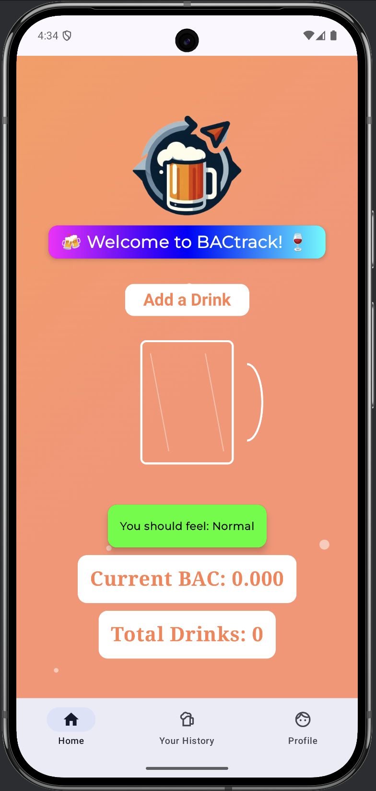

# BACtrack Manual

## Product Purpose
BACtrack is an Android mobile application designed to help individuals drink responsibly and stay safe. Its purpose is to provide users with a reliable tool to monitor and manage their alcohol consumption. By tracking the number and types of alcoholic drinks consumed, alongside storing personal information like weight and sex, BACtrack estimates the user’s Blood Alcohol Content (BAC) in real-time. It also offers insights into how users may feel based on their BAC levels.

BACtrack promotes health-conscious drinking habits by enabling users to analyze and understand their consumption patterns through visual BAC representations and historical data tracking. It simplifies the process of logging drinks—even without actively using the app—ensuring ease of use in social settings. Additionally, the app prioritizes safety by maintaining critical emergency contact information.

Designed with an intuitive and user-friendly interface, BACtrack is accessible to all users, empowering them to make informed decisions and adopt safer drinking practices.

---

## Intended User Audience

BACtrack is intended for legal-aged individuals who consume alcohol and are seeking a tool to help them track and manage their drinking responsibly. The target user audience includes:

### Primary Users:
1. **Health-Conscious Drinkers**:
   - Individuals interested in tracking their alcohol intake to maintain healthier drinking habits.
   - Users who want to avoid excessive consumption by understanding their BAC levels.

2. **Social Drinkers**:
   - People who enjoy casual drinking and want to stay informed about their alcohol consumption in social settings.

3. **Safety-Conscious Users**:
   - Individuals who wish to manage their drinking while staying aware of their potential impairment levels.
   - People looking to have emergency contacts readily available for unforeseen situations.

### Secondary Users:
1. **Supporters of Responsible Drinking**:
   - Family members or friends of individuals who drink alcohol, encouraging them to monitor their habits responsibly.

2. **Data-Driven Users**:
   - Users who are interested in reviewing their historical drinking data to identify patterns or improve habits.

---

## Installation Guide

### Instructions on Downloading and Installing the App

In our release tag named `v1.0.1`, you will find a ZIP folder containing the APK file for the application.  
Download and extract the ZIP folder to access the APK. Transfer the APK file to your Android device and install it.  
Please note that the app has been tested on devices running Android 12 and newer. We cannot guarantee compatibility with earlier Android versions.

### Instructions for Virtual Deployment

1. **Download Android Studio**
   - Download Android Studio from the following link: [Android Studio](https://developer.android.com/studio).

2. **Set Up the Project**
   - Once installed, open Android Studio.  
   - Navigate to **File > New > Project From Version Control**.  
   - Paste the following repository link into the text box:  
      `https://github.com/ucsb-cs184-f24/team10AlcTracker.git`.

3. **Compile the Program**
   - Wait for the project to download and the program to compile fully.

4. **Run the Project**
   - Press the green **“Play”** button at the top of the Android Studio interface.  
   - The project will start up in the default emulator.

5. **Test the Application**
   - Ensure you have a stable internet connection.  
   - Select **“Sign in with GitHub”**.  
   - Enter your credentials to log in and start using the app!

6. **Troubleshooting**
   - If you encounter issues related to `.gitignore` files or other setup problems, please contact the team for assistance.

---

## Getting Started

Welcome to BACtrack! Follow these simple steps to set up your profile and start using the app.

**Step 1: Open the Application**
- After downloading and installing BACtrack, open the app on your phone.

**Step 2: Log In**
- Once the app is open, you’ll see the login screen:

- Log in using your **Google** or **GitHub** credentials.

**Step 3: Access Your Profile**

After logging in, you will land on the **Profile** tab:

- Add your weight in kilograms (kg) and select your biological gender to help the app calculate your Blood Alcohol Concentration accurately.
- Then, click **Save**.

**Step 4: Enter Personal Information**

Tap on **Your Data**:

Enter your personal details, including:
- Name
- Birth date
- Email address
- Phone number
- Emergency contact information

**Step 5: Navigate to the Home Page**

Tap on **Home** to access the main page of the app.

**Step 6: Add Your First Drink**
- Start tracking your Blood Alcohol Concentration (BAC) by adding your first drink.

You’re all set! BACtrack is now ready to help you monitor your alcohol consumption responsibly. If you encounter any issues, feel free to reach out to our support team. Happy tracking!

---

## Features and Functionality
The BACtrack Android application provides users with a comprehensive tool to track their Blood Alcohol Concentration (BAC) while offering features to ensure responsible drinking and user safety. Below are the key features and functionalities of the app:

1. **Drink Management on the Home Page**

- Users can manage their drink entries conveniently from the Home Page:

   - **Add Default Drinks**: Quickly add common drinks such as wine, beer, shots, and cocktails to your session by clicking on the “Add Drink” button and selecting the drink you would like to add.

   - **Add Personalized Drinks**:
      - Create custom drink entries by specifying the drink name and alcohol weight.
      
      - Save personalized drinks for future sessions or delete them from the menu when no longer needed.
      

   - **Cancel at Any Time**: Users can cancel adding a new drink at any step in the process.

2. **Session Monitoring**

   - The Home Page provides real-time tracking of:
      - **Number of Drinks**: Displays the total drinks consumed in the current session.
      - **Blood Alcohol Concentration (BAC)**: Calculates and displays your BAC based on your inputs.
      - **How You May Be Feeling**: Provides informative insights into your potential physical and cognitive state based on your BAC level.
   

3. **Session History**

- The History screen allows users to review details of their previous drinking sessions:
   - **Session Overview**: View start and end times of drinking sessions, peak BAC levels, and the total duration of the session.
   - **Automatic Updates**: The history updates automatically once a session ends, meaning the user’s BAC has returned to 0.

4. **Profile Management**
- The Profile screen provides a centralized location for personal and health information:
   - **Modify Personal and Health Details**: Update weight, biological gender, and contact information easily.
   
   - **Logout Option**: Securely log out of the application using the red “Logout” button for data security.
   

5. **Emergency Contact Integration**
- To promote safety, the app automatically calls and texts the user’s emergency contact if their BAC level reaches a risky threshold (BAC > 0.3). This ensures that users have a reliable safeguard when they’ve consumed too much alcohol.

The BACtrack application combines user-friendly functionality with essential safety measures to empower users to monitor their drinking habits responsibly and stay safe. Whether you’re managing your drinks, reviewing your history, or relying on emergency support, BACtrack provides an intuitive and reliable experience for all users.

---

## Navigation
The BACtrack app is designed to be intuitive and user-friendly. Below is an overview of the app’s main sections and how to navigate them:

1. **Home Screen**
   - Purpose: This is the default screen where users can add drinks, view their current Blood Alcohol Concentration (BAC), and see the total number of drinks consumed during a session.
   - Navigation:
      - Tap the “Add a Drink” button to log a new drink. Users can select from default options (e.g., beer, wine, cocktail) or create custom drinks.
      - The displayed BAC updates in real time as drinks are added.
   - Features:
      - BAC level and “How You May Feel” section provide quick feedback.
      - Options to cancel drink entries or delete custom drinks.
   

2. **Your History**
   - Purpose: Displays a list of past drinking sessions.
   - Navigation:
      - Tap the “Your History” icon at the bottom menu bar.
      - View detailed information about each session, including:
         - Start and end times.
         - Peak BAC levels.
         - Duration of drinking session.
   - History updates automatically when the user’s BAC returns to 0 after a session.

3. **Profile Screen**
   - Purpose: Allows users to manage their personal and health information.
   - Navigation:
      - Tap the “Profile” icon in the bottom menu bar.
      - Sections include:
         - Your Data: Add or modify personal details such as name, birthdate, email, phone number, and emergency contact information.
         - Health Info: Enter weight (in kilograms) and biological gender to improve BAC calculations.
         - Log Out: Red button at the bottom of the screen to safely exit the app.
   - Tip: Ensure accurate details for more precise BAC tracking.
   

4. **Accessing Other Features**
   - Use the bottom navigation bar to switch between “Home,” “Your History,” and “Profile” screens.
   - Each screen is labeled for easy identification.

5. **Emergency Contact Notification**
   - The app will automatically alert your emergency contact if your BAC reaches a risky level.
   - Ensure emergency contact details are correctly entered under **“Profile > Your Data.”**

**Tips for Smooth Navigation:**

- **Icons and Labels**: The bottom menu bar icons are intuitive, with **“Home,” “Your History,”** and **“Profile”** clearly indicated.
- **Customization**: If you create personalized drinks or update your profile information, the app will automatically save changes.
- **Logging Out**: Use the **“Log Out”** button on the Profile screen for security if you’re sharing a device.

---

## Legal and Safety Information

### Disclaimers

1. **Accuracy of BAC Calculations**
   - The BACtrack app provides an **estimate** of Blood Alcohol Concentration (BAC) based on user inputs and known alcohol absorption rates.
   - This estimate may vary based on factors such as individual metabolism, food consumption, and health conditions.
   - **Disclaimer:** The BAC readings provided by this app are for informational purposes only and should not be used to determine the user’s ability to drive or operate machinery safely.

2. **Legal Responsibility**
   - The app does not absolve users of their responsibility to follow local laws regarding alcohol consumption and driving under the influence (DUI).
   - Users are advised to adhere to the legal BAC limits in their respective jurisdictions.

3. **No Substitute for Medical Advice**
   - This app is not intended to provide medical advice, and users should consult healthcare professionals regarding alcohol consumption and its effects.

### Responsible Drinking Advice

1. **Drink Responsibly**
   - **Know your limits:** Always monitor the amount of alcohol you consume.
   - **Avoid binge drinking:** Spread out your drinks over time to avoid excessive intoxication.

2. **Plan Ahead**
   - If you plan to drink, designate a sober driver, arrange for a ride-sharing service, or use public transportation.
   - Avoid drinking on an empty stomach to reduce the rapid absorption of alcohol.

3. **Monitor Your Health**
   - Ensure you stay hydrated while consuming alcohol by drinking water or non-alcoholic beverages between drinks.
   - If you feel unwell or intoxicated, stop drinking immediately and seek assistance if necessary.

4. **Safety Tips**
   - Never drive after consuming alcohol, even if your BAC appears low.
   - Avoid drinking alone and let someone know your plans if you are consuming alcohol.
   - Use the **emergency contact feature** in the BACtrack app if you feel unsafe or require assistance.

### Emergency Contact Feature
- The app will alert the emergency contact specified in your profile if your BAC exceeds a risky level.
- Users are advised to keep their emergency contact information updated.

---

## Development Team and Acknowledgments

The BACtrack app was developed by **Team 10** of UCSB-CS184 as part of the course project for the Fall 2024 term in the Mobile App Development course. The team worked diligently to create an application that promotes responsible alcohol consumption and personal safety.

### Team Members
We would like to express our gratitude to the following team members for their contributions:
- **Mariana Rosillo**
- **Ivan Hernandez**
- **Elijah Anderson**
- **Madison Long**
- **Maya Rosenbaum**
- **Konark Vinod**

### Special Thanks
Special thanks to our instructors and mentors for their guidance throughout the development process.

### Development Repository

The project’s code and additional documentation can be accessed via GitHub:
- **[BACtrack GitHub Repository](https://github.com/ucsb-cs184-f24/team10AlcTracker.git)**

This repository serves as a resource for exploring the app’s functionality, technical details, and future enhancements. If you’d like to provide any feedback or support, please reach out to the team via the project repository.
