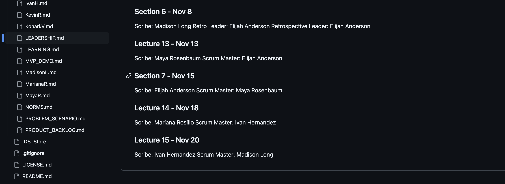

After my contributions have been made, I have been able to organize our documentation inp ur repository by updating and adding files, and adding the first drafts of our DESIGN and MANUAL - documents that are very important for us teh developers, stakeholders and users.

Below, you can find screenshots of my additions (which can be compared to the before state in this same folder).

---
### LEADESHIP.md

This file now contains up to date documentation of the team's leadership roles taken as we develop the app.

---
### MANUAL.md

I added a first draft of the user manual. It includes the BACtrack purpose and the intended user audience. In addition it contains placeholders of other sections we want to include in the manual.

---
### DESIGN.md

I added a first draft of the design document. it includes the basic system architecture, the team decisions, and the UX principles.

---
### Team meetings

I added any missing documentation of our team meeting and reorganized them so that they would be in the correct sprint folder:

