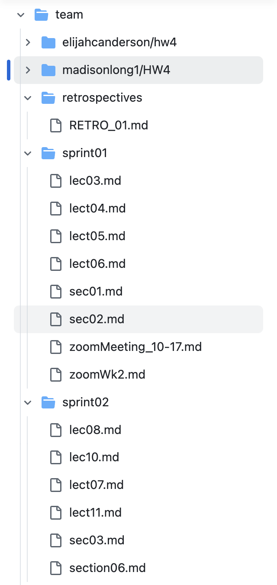
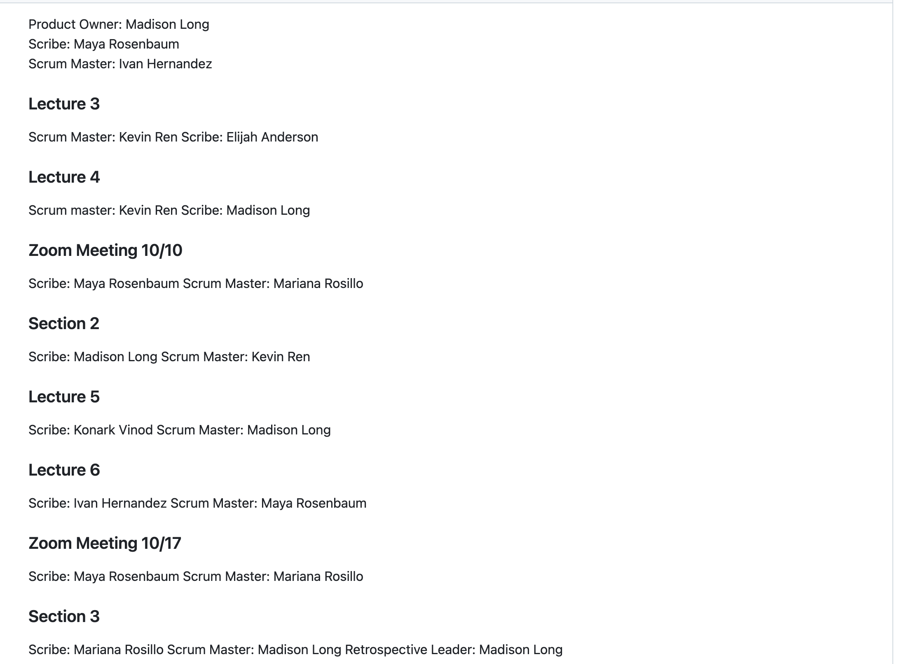

## Before Documentation/Design Implementation 

As of now, most of our meetings have been documented in GitHub. Nonetheless, it still needs some polishing, and we need to document some other meetings in our GitHub, so that all the work we have done is displayed correctly. Here is the current state of the meetings documented:

In addition to that, the Leadership document is not updated, as shown here: 

**Note:** We have been documented the roles in our meeting documentation.

In addition to that, in the screenshots, it is shown that there is no Design Document. That is something I will be adding.